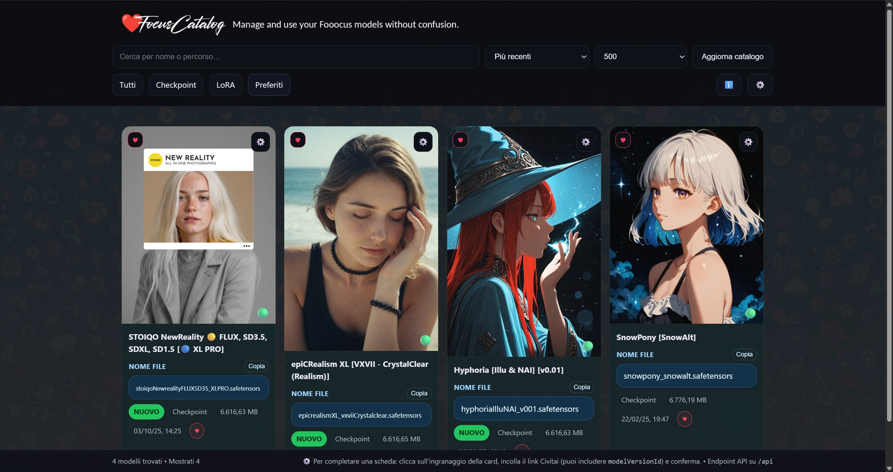
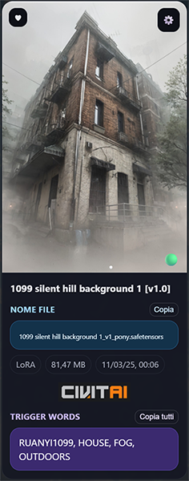

# Find your LoRA or Checkpoint immediately, copy and paste it into Fooocus. For an immediate workflow.
# ❤️ FocusCatalog (Fooocus Tool)
Fooocus Tool to organise your LoRA and Checkpoint templates with previews of template names and TRIGGER WORDS always ready to copy and paste.

FocusCatalog was born out of necessity.  
Working with Fooocus quickly becomes frustrating: dozens (or hundreds) of models and LoRA files accumulate, often with cryptic names and no previews.  
This chaos makes it almost impossible to keep a clean workflow, to remember which model does what, or to quickly find the right LoRA for a project.

FocusCatalog was created exactly to solve this problem.  
It brings **clarity and order** to your models library: scans your folders, creates an index with thumbnails, displays file size and modification date, and – if you want – fetches **previews and trigger words directly from Civitai**.  
What used to be messy folders now becomes a clear and browsable catalog.

---

## ✨ Features
- Automatic scan of Checkpoints and LoRA folders
- Generates a JSON index with metadata
- Local preview support (simply place an image next to the model file)
- Fetches display name, preview images, and trigger words from **Civitai**
- "NEW" badge for recently added models
- Mark models as favorites ❤️ or toggle NSFW visibility
- Configurable folders and settings saved in `options.html`
- Runs entirely locally with a simple **Flask web server**
- Supported languages: Italian, English, Spanish, and French.



## 📖 Documentation
A full prompt manual is included in help.html (best practices, prompt structure, trigger words, troubleshooting).

---

## 🚀 Quick Start

### Run locally with Python
Requirements: Python 3.9+

```bash
pip install flask flask-cors pillow requests
python server.py --out public
```
Open: http://127.0.0.1:8765

Run with Docker (recommended)
```bash
docker build -t focuscatalog
docker run -it -p 8765:8765 -v /path/to/models:/models focuscatalog
```
Replace /path/to/models with the folder containing your Fooocus models.

